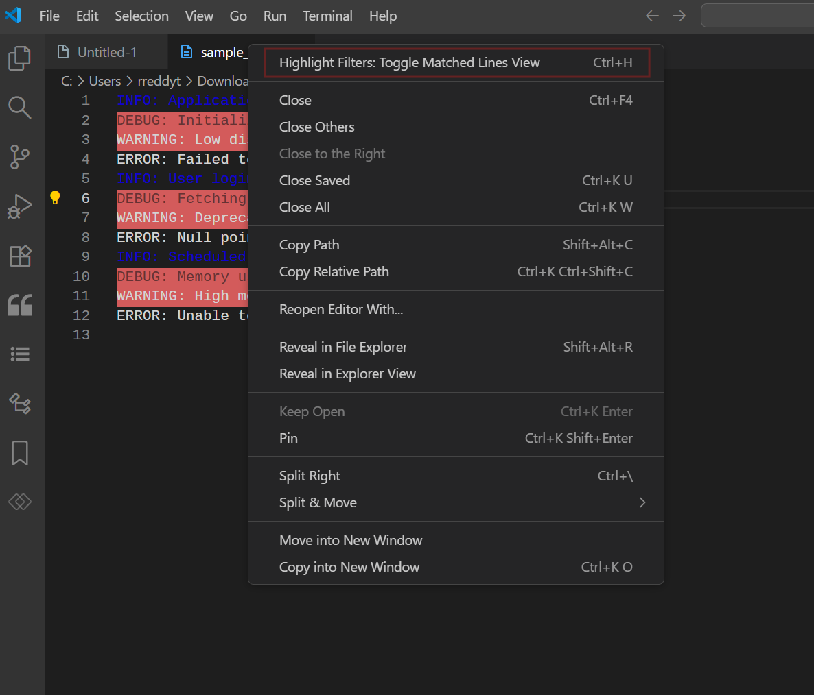
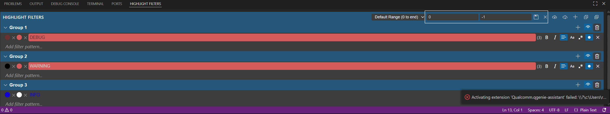

This extension trry to provide Text analysis based on markers similar to https://textanalysistool.github.io/
# Groups
1. Each Group can be thought of as a logical entity
2. Can define multiple groups which may represent multiple entities in a system
3. Rename the Group as required
4. Can enable or disable all filters in a group.
5. Can delete the group.

# Filters
4. Configure each filter with foreground and background colors. 
5. Apply text formatting like Bold, Italic.
6. Case sentive search, regex
7. Drag and drop between different groups

<video width="640" height="360" controls>
  <source src="media/Create_group_filters.mp4" type="video/mp4">
  Your browser does not support the video tag.
</video>

## Toggle file view with only matched lines or entire file view. Default Short cut `Ctrl+H`

## Add Ranges to filter the lines only in that range of lines
1. Add Range by specifying the start line and end line. And clok on save.
2. Delete ranges if no longer required.
3. Select the desired ranges in drop down
